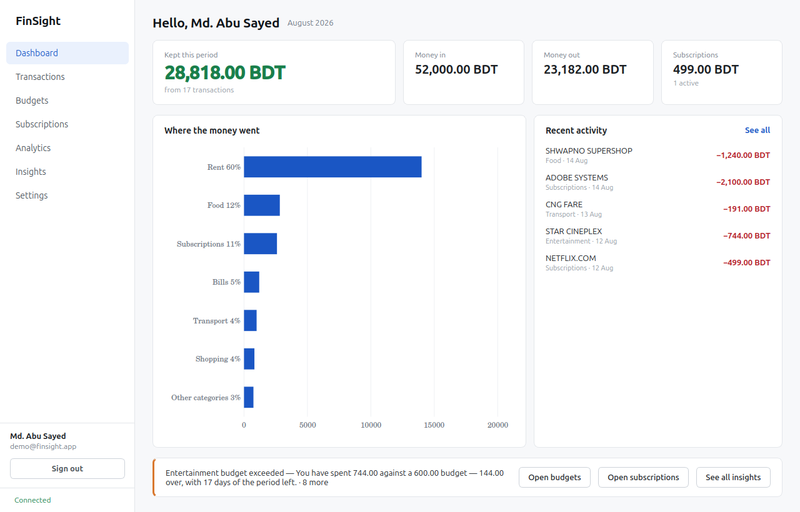
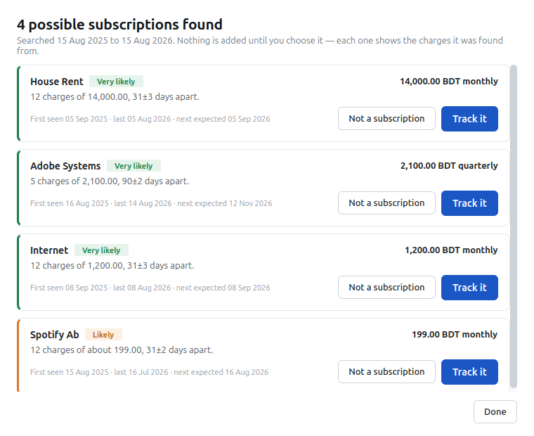

# FinSight

> Personal finance and subscription intelligence — a desktop application.

**Status:** complete. Seven working sections, a deterministic insights engine,
automatic detection of recurring subscriptions from transaction history, and CSV
import that cannot half-happen.

FinSight helps one person understand where their money goes: spending by
category, budget health, trends over time, and — its distinguishing feature —
automatic detection of recurring subscriptions hidden inside ordinary
transaction history.

FinSight does **not** connect to banks or payment providers. Data is entered by
hand or imported from CSV.



---

## What it does

| | |
|---|---|
| **Transactions** | Filter, sort and page through history — all of it in SQL, so "sort by amount" sorts four thousand rows rather than the twenty-five on screen |
| **Budgets** | A limit per category per period, with spent, remaining and status recomputed on every read and stored nowhere |
| **Subscriptions** | What recurs, what it costs per month and per year, and what renews next |
| **Dashboard** | The whole first screen in one request, so no two figures on it come from different moments |
| **Analytics** | Income against expense by month, and this period against the one before it |
| **Insights** | Rules that explain themselves: every finding names the figure it found and what it was compared against |
| **Find subscriptions** | Recurrence detection over transaction history — the one genuine algorithm here |
| **Import / export** | CSV out, and CSV in via a preview that must be seen before it can be applied |
| **Settings** | The account, and the categories everything else files things into |

### The two features worth looking at

**Subscription detection** reads a year of ordinary transactions and proposes
what recurs. It normalises merchant names, clusters charges by amount with
tolerance so a price rise stays one subscription, scores how regular the
intervals are, and returns a sentence a person can check — *"12 charges of
about 199.00, 31±2 days apart"* — rather than a percentage nobody can verify.
It creates nothing; the user confirms each one.



**CSV import is two requests, not one.** The preview reads the file, resolves
every category, finds every duplicate and reports exactly what would happen —
writing nothing. The import applies it, and refuses to run without the
fingerprint the preview returned. That fingerprint covers the options as well as
the bytes, so a file previewed as day-first cannot be imported as month-first.
Every row lands or none does.

---

## Architecture

```
PySide6 widgets
      │
      ▼
  API client            ← the only place the GUI performs HTTP
      │
      ▼  HTTP / REST
FastAPI routers         ← parse, delegate, return
      │
      ▼
  Services              ← business logic, Decimal arithmetic
      │
      ▼
 Repositories           ← all SQLAlchemy query construction
      │
      ▼
    MySQL
```

The GUI never touches the database. Business logic never appears in widgets or
in route handlers.

The parts that are *only* arithmetic — budget utilisation, billing cycles,
insight rules, recurrence detection, CSV parsing, rate limiting — are pure
modules with no session and no clock: dates and decimals in, values out. Each is
tested directly, which is why a boundary case costs three lines to check instead
of a database round trip.

| Layer | Technology |
|---|---|
| Desktop client | PySide6 (Qt 6), QtCharts |
| API | FastAPI |
| Data access | SQLAlchemy 2.0 (synchronous) |
| Migrations | Alembic |
| Database | MySQL 8.4 (PyMySQL) |
| Validation | Pydantic v2 / Pydantic Settings |
| Testing | pytest, httpx, pytest-qt |

Runs on Linux and Windows.

---

## Decisions worth knowing

Forty-two decisions are recorded in [`docs/DECISIONS.md`](docs/DECISIONS.md),
each with what was rejected and why. The ones that shaped the most code:

- **Money is `DECIMAL` everywhere, and a JSON *string* on the wire.** A JSON
  number is an IEEE double, so serialising an amount as a number reintroduces
  exactly the imprecision `Decimal` was chosen to avoid (ADR-003).
- **Derived figures are computed, never stored.** A stored total is a cache, and
  it is wrong the moment a transaction is edited (ADR-015).
- **Tests run against real MySQL, not SQLite.** The analytics layer depends on
  date functions and `GROUP BY` semantics the two databases disagree about, so
  SQLite would give passing tests for code that fails in production (ADR-005).
- **Layout defects are found by rendering, not by reading.** Qt views are
  screenshotted offscreen and looked at. This has caught a real defect in every
  single interface phase — including a primary button painted in nothing, a
  checkbox with no box, and combo boxes that had no dropdown arrow for seven
  phases (ADR-012, ADR-022, ADR-024).
- **Charts do not colour by category.** Measured, nine categorical hues cannot
  be made distinguishable for every pair at once; that is a property of the
  colour space, not of the choices. So the spending chart uses one hue and lets
  the axis labels carry identity (ADR-026).
- **Detection matches merchants conservatively.** A missed subscription costs
  the user nothing. A merged pair produces a confident, wrong claim about their
  money (ADR-031).
- **A candidate whose evidence refutes itself is never offered.** "98±69 days
  apart" is not a rhythm, whatever confidence is attached to it, so the spread
  shown is bounded against the interval shown — the rule is checked on the exact
  figures the reader sees (ADR-040).
- **Sign-in is throttled per address, never per email.** Throttling per email
  would let anyone lock the owner out of their own account — the protection
  becomes the attack (ADR-036).

Known limitations are listed honestly in
[`docs/PROGRESS.md`](docs/PROGRESS.md), including the ones that are scope
decisions and the ones that are not.

---

## Getting started

Requires **Python 3.11+** and **MySQL 8**.

**1. Install dependencies**

```bash
python3 -m venv .venv
.venv/bin/pip install -r requirements.txt -r requirements-dev.txt
```

On Windows, use `.venv\Scripts\pip`.

**2. Configure**

```bash
cp .env.example .env
python3 -c "import secrets; print(secrets.token_urlsafe(48))"   # paste into SECRET_KEY
```

**3. Create the databases**

```bash
./scripts/setup_database.sh
```

Asks for a new password, creates the `finsight` and `finsight_test` databases
and a MySQL user restricted to them, then writes the connection URLs into
`.env`. The password is never written to a tracked file — which is why this is a
script that asks rather than a `.sql` file with a password typed into it.

**4. Apply the migrations**

```bash
cd backend && ../.venv/bin/python -m alembic upgrade head
```

Schema details are in [`docs/DATABASE.md`](docs/DATABASE.md).

**5. Run**

```bash
./scripts/dev.sh              # Linux/macOS — backend and client together
.\scripts\dev.ps1             # Windows PowerShell
```

Either half alone: `./scripts/dev.sh backend` or `./scripts/dev.sh client`.

- API: <http://127.0.0.1:8000>
- Interactive API documentation: <http://127.0.0.1:8000/docs>

### Installing it as a desktop application

To launch FinSight from the application menu like anything else, rather than
from a terminal:

```bash
./scripts/install-desktop-entry.sh
```

That writes a single file to `~/.local/share/applications`. Nothing goes
system-wide and nothing needs root. Search for **FinSight** in the launcher.

The menu item runs `scripts/finsight.sh`, which starts the API, waits for it to
answer before opening the window — so the first screen is never a
"backend offline" one that fixes itself a second later — and stops the API
again when the window closes. If it cannot start, it says why in a dialog
rather than on a console nobody is watching.

MySQL still has to be running; on Ubuntu it starts with the machine
(`systemctl status mysql`). The entry points at this checkout, so if you move
the project, re-run the script.

#### Using your own logo

Drop a PNG at `frontend/client/resources/finsight.png` and re-run the install
script. It is preferred over the bundled SVG in both places a logo appears —
the launcher entry and the window's own icon — so there is one file to replace
and nothing to keep in sync:

```bash
cp /path/to/your-logo.png frontend/client/resources/finsight.png
./scripts/install-desktop-entry.sh
```

Square, and 256×256 or larger, since the desktop scales one image down to
every size it needs. Delete the PNG to go back to the bundled icon.

To remove the launcher entry:

```bash
./scripts/install-desktop-entry.sh --uninstall
```

### Sharing it with somebody else

`packaging/` builds a copy that runs without Python, a virtual environment or a
terminal — the API is bundled with the window and served from the same process:

```bash
.venv/bin/pip install pyinstaller
.venv/bin/pyinstaller packaging/finsight.spec --noconfirm
cd dist && zip -r FinSight-linux.zip FinSight
```

For **Windows**, run the *Windows build* workflow from the Actions tab and
download the `FinSight-windows-x86_64` artifact — a Windows executable can only
be produced on Windows, and the workflow does that on a runner so no Windows
machine is needed.

The recipient still needs **MySQL** and their own `.env`; see
[`packaging/README.md`](packaging/README.md) for what to send and what never to
send. Never include your own `.env` — it holds your `SECRET_KEY` and database
password.

### Two terminals, without the script

The script is a convenience; it starts these. Run them by hand when you want
the backend to survive a client restart, or to watch either half's log on its
own. Both paths are relative to the project root, and on Windows the
interpreter is `..\.venv\Scripts\python`.

**Backend** — `--reload` restarts it when you edit the API:

```bash
cd backend && ../.venv/bin/python -m uvicorn app.main:app --host 127.0.0.1 --port 8000 --reload
```

**Frontend**, in a second terminal:

```bash
cd frontend && ../.venv/bin/python -m client.main
```

`cd` first, then `-m`: run as a module from `frontend/` so that `client.*`
imports resolve. Start the backend first — the client opens without it, but the
sidebar says *Disconnected* and every action fails until it is up.

On Python 3.14 the `../.venv/…` interpreter prints a harmless
`RuntimeWarning: Unexpected value in sys.prefix` before the client starts. To
avoid it, run either half from the project root instead, with no `cd`:

```bash
.venv/bin/python -m uvicorn app.main:app --app-dir backend --port 8000 --reload
.venv/bin/python frontend/client/main.py
```

---

## Trying it with real data

An empty account demonstrates nothing. With the backend running:

```bash
.venv/bin/python scripts/seed_demo.py
```

This creates `demo@finsight.app` (password `demo-account-password`) and fills it
with a year of history through the API — the same calls the interface makes, so
nothing in it could have bypassed a rule.

The history is deliberately shaped: three genuine subscriptions, one of them
with a price rise partway through; a gym paid at irregular intervals, which
detection must *not* propose; and a charge whose description carries no merchant
at all, which is a limitation the application states rather than hides. A unit
test runs the real detector over it and asserts exactly that.

Then open **Subscriptions → Find subscriptions**: two of the three are untracked
and waiting to be found.

To retake the screenshots in `docs/screenshots/`:

```bash
.venv/bin/python scripts/screenshots.py
```

They are captured offscreen from the real client against the real backend, so a
screenshot cannot show a screen the application does not produce.

---

## Testing

```bash
.venv/bin/python -m pytest              # everything — 1179 tests
.venv/bin/python -m pytest backend      # backend only
.venv/bin/python -m pytest -m gui       # desktop client only
```

Tests are written within each phase; there is no separate testing phase and no
phase ends without a green run. GUI tests use pytest-qt and fall back to Qt's
offscreen renderer where there is no display.

The suite includes things a functional test cannot see: statement counts, so an
N+1 query cannot pass unnoticed; pixel samples, so a button painted in nothing
is caught; and a test asserting that autogenerate finds no difference between
the models and the migrated schema, so a model changed without a migration
fails immediately.

Linting and formatting use ruff:

```bash
.venv/bin/ruff check .
.venv/bin/ruff format .
```

If the database-backed tests fail at collection rather than failing honestly,
MySQL is not running or `finsight_test` does not exist — `./scripts/setup_database.sh`
is the fix.

---

## Project layout

```
backend/
  app/
    api/v1/        route handlers — parse, delegate, return
    core/          configuration, logging, security, money, rate limiting
    db/            engine and session management
    models/        SQLAlchemy ORM models
    schemas/       Pydantic request/response models
    services/      business logic, including the pure calculation modules
    repositories/  database queries
    main.py        application factory
  tools/           demo-data generator (not part of the application)
  tests/           unit/, api/ and db/
frontend/
  client/
    api/           the only place the client makes HTTP calls
    core/          client configuration and session state
    models/        Qt item models — the adapter between data and a view
    views/         one view per section
    widgets/       reusable interface components
    resources/     stylesheet and assets
    main.py        entry point
  tests/
docs/              decisions, schema, progress, demo script, screenshots
scripts/           database setup, launchers, demo seeding, screenshots
```

## Licence

To be decided.
